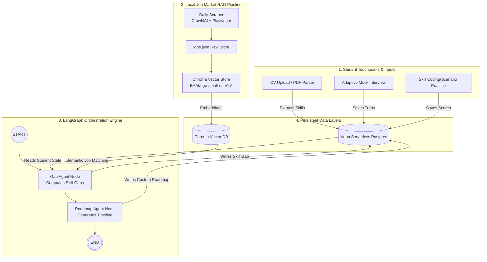

# Disha AI 

**An Advanced Agentic RAG + LangGraph Career Navigation & Preparation Platform for Nepali Students.**

> *Navigate your direction. Leverage Nepal's real job market data. Build your future.*

Disha AI is a state-of-the-art career guidance platform designed specifically for students in Nepal. Unlike general-purpose global career advisors, Disha connects directly to the local job ecosystem. It parses student profiles, administers adaptive AI mock interviews, verifies skills through code/scenario challenges, conducts hybrid vector-based retrieval on live Nepali job postings, and uses a LangGraph-powered multi-agent system to discover skill gaps and construct personalized week-by-week learning paths.

---

## 🌟 Key Features

*   **Agentic RAG Engine**: Daily scrapers crawl local portals (KamKhoj, MeroJob, KumariJob, etc.) using Crawl4AI & Playwright, embed descriptions locally with `BAAI/bge-small-en-v1.5`, and ingest them into a ChromaDB vector store.
*   **LangGraph Orchestrator**: Manages stateful agent transitions across career discovery phases (`intake` → `gap assessment` → `roadmap generation`) with conditional routing.
*   **Intelligent CV Parsing**: Resume extraction utilizing Mistral OCR (`mistral-ocr-2512`) combined with Groq (`llama-3.1-8b-instant`) to capture granular skills.
*   **Adaptive Mock Interviews**: Real-time voice/text interactive interviews that adjust dynamically to student responses, providing objective grading.
*   **Verified Skill Challenges**: Real coding and scenario-based tests to benchmark capabilities against live job market demands.
*   **Personalized Roadmaps**: Curated, time-and-budget-constrained educational roadmaps mapped directly to local career targets.

---

## 🏗️ Architecture & Data Flow

Disha AI uses a stateful agent topology built on **LangGraph** coordinated with a multi-layered **RAG (Retrieval-Augged Generation)** pipeline.



### 🧠 Agentic RAG & LangGraph Workflows
1.  **State Management (`CareerState`)**:
    *   Tracks user parameters: `student_skills`, `target_role`, `location`, `time_per_week`, and `budget`.
    *   Saves outputs: `skill_gap` details and the final week-by-week `roadmap`.
2.  **Gap Assessment Agent (`gap_node`)**:
    *   Queries ChromaDB using local sentence-transformer embeddings to fetch real-time local job postings matching `target_role`.
    *   Compares the student's current skills (retrieved from profile/CV/interviews) against the market-required skills using LLM synthesis.
    *   Compiles a complete skill gap report identifying missing libraries, tools, frameworks, and concepts.
3.  **Roadmap Agent (`roadmap_node`)**:
    *   Takes the computed `skill_gap` list and designs a structured learning roadmap.
    *   Adapts the plan to the student's constraints (e.g., *15 hours/week, 0 budget* vs. *40 hours/week, 5000 NPR budget*).

---

## 📂 Repository Layout

```
disha.ai/
├── backend/                       # FastAPI Engine, LangGraph Agents, Scrapers, RAG
│   ├── app/
│   │   ├── api/
│   │   │   └── routes/            # REST API endpoints (profile, interview, practice, RAG)
│   │   ├── db/                    # SQLAlchemy models & Neon DB sessions
│   │   ├── orchestrator/          # LangGraph agent definitions
│   │   │   ├── nodes/             # Specialist agent nodes (gap, roadmap)
│   │   │   ├── graph.py           # StateGraph setup & compilation
│   │   │   └── state.py           # TypedDict CareerState schema
│   │   ├── rag/                   # Chroma DB ingestion, BGE embeddings, search scripts
│   │   └── services/              # Business logic (CV parser, voice services, scoring)
│   ├── scraper/                   # Crawl4AI web scraper & portal crawlers
│   ├── migrations/                # Alembic database migrations
│   ├── scripts/                   # CLI tools & job refresh scripts
│   └── data/                      # jobs.json cache & chroma DB files (Gitignored)
│
└── frontend/                      # Next.js 16 Web Dashboard
    ├── app/                       # App Router layouts, pages, and components
    ├── public/                    # Static assets
    └── package.json               # NPM configuration
```

---

## 🛠️ Technology Stack

| Category | Technology | Role / Purpose |
| :--- | :--- | :--- |
| **Backend Core** | Python 3.14 + FastAPI | High-performance async API server |
| **Package Manager** | `uv` | Superfast dependency syncing & virtualenv management |
| **Orchestration** | LangGraph | State management and agent routing |
| **Agent LLM** | Groq (`llama-3.1-8b-instant`) | Fast inference for structured skills, Q&A, and scoring |
| **Vector DB** | ChromaDB | Local vector indexing of scraped job descriptions |
| **Embeddings** | `sentence-transformers` | BAAI/bge-small-en-v1.5 model for semantic query mapping |
| **Web Scraping** | Crawl4AI + Playwright | Daily crawling of dynamic single-page applications |
| **OCR Service** | Mistral OCR | High-accuracy parsing of PDF student CVs |
| **Voice Services** | Google Cloud Speech-to-Text & Text-to-Speech | Hands-free verbal mock interview options |
| **Database** | Neon Postgres + SQLAlchemy (asyncpg) | Relational store for users, profiles, and history |
| **Frontend Core** | Next.js 16 (React 19) | Modern, interactive career dashboard UI |
| **Styling** | Tailwind CSS 4 | Responsive, custom components and styling |

---

## ⚡ Quick Start Guide

### 📋 Prerequisites
- **Python 3.14+** (with `uv` installed)
- **Node.js 20+** (frontend only)
- **Neon Postgres** database instance
- Credentials/API keys for: **Groq** (required), **Mistral** (CV + interview), optional **Google Cloud** (voice)

> **Full step-by-step setup:** see [SETUP.md](SETUP.md)

### 1. Setting Up the Backend

1.  Navigate to the backend directory and configure environmental variables:
    ```bash
    cd backend
    cp .env.example .env
    ```
2.  Populate your `.env` file (minimum: `GROQ_API_KEY` + `DATABASE_URL`). See [backend/.env.example](backend/.env.example).
3.  Install python dependencies and initialize database schemas:
    ```bash
    uv sync
    uv run playwright install chromium
    uv run alembic upgrade head
    ```
4.  Run the local FastAPI server:
    ```bash
    uv run uvicorn app.main:app --reload --port 8000
    ```
    *API documentation will be available at: http://127.0.0.1:8000/docs*

### 2. Scraping & Ingesting Job Data (First Run)

To populate the local vector database with real Nepali job listings:
```bash
cd backend
# Set cache directory for Crawl4AI
export CRAWL4AI_BASE_DIRECTORY=./.crawl4ai

# Run scraper to collect raw postings
uv run python -m scraper.run --mode hybrid --max-per-source 150 --log-db --log-file

# Ingest and embed listings into ChromaDB
uv run python -m app.rag.ingest --reset
```
*Tip: You can also use the helper script: `./scripts/refresh_jobs.sh 100`*

### 3. Setting Up the Frontend

1.  Navigate to the frontend directory:
    ```bash
    cd ../frontend
    ```
2.  Install packages and start the Next.js development server:
    ```bash
    npm install
    npm run dev
    ```
    *The frontend dashboard will run at: http://localhost:3000*

---

## 📡 API Reference Checklist

### Student Endpoints
*   `POST /api/profile` - Creates/updates the student's target role, constraints, and current skills.
*   `POST /api/profile/upload-resume` - Uploads a PDF CV, processes with Mistral OCR, and extracts skills using Groq.
*   `POST /api/interview/start` - Launches an adaptive mock interview session based on target skills.
*   `POST /api/interview/answer` - Evaluates the student's voice/text response, saves scores, and returns the next question.
*   `POST /api/practice/skills/suggest` - Analyzes profile and market data to recommend priority practice subjects.
*   `POST /api/practice/start` - Begins a practice session with tailored coding tasks or scenario challenges.
*   `POST /api/practice/{id}/submit` - Evaluates challenge submissions.
*   `POST /api/gap` - Triggers the LangGraph pipeline to synthesize CV, interview performance, and practice results against ChromaDB local job listings.
*   `POST /api/roadmap` - Generates a week-by-week learning roadmap based on the computed gaps and budget constraints.

### Admin & Telemetry Endpoints
*   `POST /api/admin/scrape` - Triggers background scrapers (requires `X-Admin-Key` header).
*   `GET /api/admin/scrape/runs` - Lists telemetry and logs from recent scraper runs.

---

## 🚀 The Student Roadmap Journey

```
[ Upload CV or input skills ]
            │
            ▼
[ Adaptive Mock Interview ] ──> Evaluates soft skills, architecture, & logic
            │
            ▼
[ Code / Scenario Challenges ] ──> Benchmarks hard execution & syntax skills
            │
            ▼
[ Compute Skill Gap (LangGraph) ] ──> Queries ChromaDB for local Nepali market demands
            │
            ▼
[ Personalized Learning Roadmap ] ──> Generates weeks-based tasks within budget & time
```

---

## 🛡️ License

Private academic project. All rights reserved. For permission or usage inquiries, contact the repository owner.
