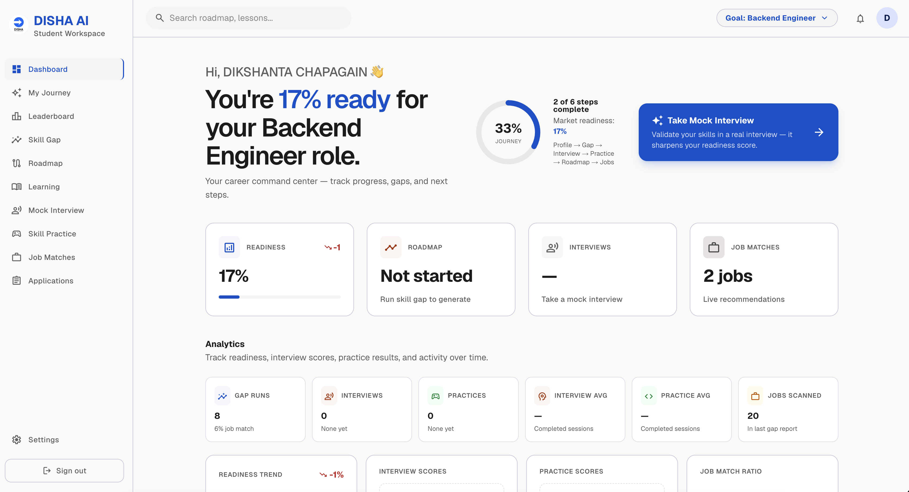
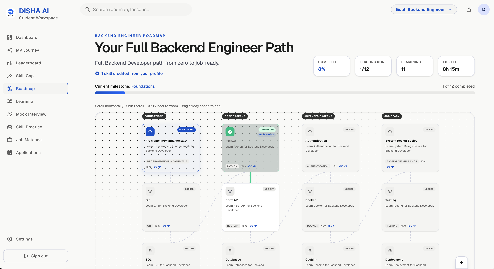

<p align="center">
  
</p>

<h1 align="center">DISHA AI</h1>

<p align="center">
  <em>Navigate your direction. Nepal job market. Build your future.</em>
</p>

<p align="center">
  Next.js 16 · FastAPI · LangGraph · MCP · Chroma · Neon Postgres · Clerk
</p>

<p align="center">
  Agentic RAG + LangGraph — from CV to job-ready on Nepal market data
</p>

---

## What is DISHA AI

DISHA AI is a career-navigation platform for Nepali students and fresh graduates. It takes a
student from CV to job-ready, grounded in **real, live Nepal job market data** rather than
generic global career advice:

```
CV upload → canonical skills catalog → voice mock interview → skill practice game
   → skill gap vs. live Nepal jobs (RAG) → LangGraph orchestrator → personalized roadmap
   → in-app learning (+ optional MCP docs/videos) → explainable job matches
   → applications tracker → leaderboard → admin human verification
```

Every claim the platform makes about a student is backed by evidence: skills come from a
fixed catalog (not free text), the skill gap report cites real job counts from scraped
postings, and an interview or practice session must actually happen before a skill is called
"verified."

## Product glimpses

Student **command center** — readiness score, journey progress, analytics, and the next action
for a chosen goal (e.g. Backend Engineer):

<p align="center">
  
</p>

**Full skill-path roadmap** — milestone columns (Foundations → Core → Advanced → Job Ready),
profile-credited skills, XP/time estimates, and an interactive pan/zoom canvas:

<p align="center">
  
</p>

## Architecture

<p align="center">
  
</p>

Reading the diagram top to bottom, mapped to what's actually in this repo:

**Clients** — the Next.js 16 student app (`frontend/app/(platform)/*`) with Clerk sign-in/up,
plus a separate key-gated admin panel (`frontend/app/admin/*`), both calling the same FastAPI
backend.

**API layer** — one FastAPI app, one router per domain (`backend/app/api/routes/`):
`profile`, `gap`, `jobs`, `interview`, `practice`, `roadmap`, `learning`, `skills`, `voice`,
`leaderboard`, `dashboard`, `admin`, plus `health`. See [API map](#api-map) below.

**Orchestrator (LangGraph)** — `backend/app/orchestrator/` wires the career pipeline as a
real, compiled `StateGraph`, not just a diagram:

```
START → intake → gap → [route_after_gap] → roadmap? → save → END
```

- `intake` (no LLM) — loads the profile, populates `student_skills`, `target_role`,
  `location`, `time_per_week`, `budget` into `CareerState`.
- `gap` — merges four signals (claimed skills, market demand, interview proof, practice
  proof) into one report, plus an optional Groq narrative and `classify_gap_size` (the
  large/small roadmap-depth decision, computed exactly once here).
- `route_after_gap` — `error` → `END`; `run_roadmap=False` → straight to `save` (snapshot
  only); otherwise → `roadmap`.
- `roadmap` — loads a role's **master skill-path** (or LLM plan when `ROADMAP_USE_LLM=true`),
  personalized from the gap report and profile-credited skills.
- `save` (no LLM) — persists the skill-gap snapshot (and roadmap, if generated).

`POST /api/gap` and `POST /api/roadmap` call the same underlying service functions directly
(to avoid re-running work across two already-tested endpoints) — the graph itself is the
independently-runnable reference pipeline:

```bash
uv run python -m app.orchestrator.run --profile-id <uuid>
```

**Gap agent** = deterministic 4-signal merge (`app/services/skill_gap.py`) + an optional Groq
narrative that is only ever allowed to explain numbers already computed — it cannot invent
skills, jobs, or scores. **Roadmap agent** = master JSON skill paths by role (default) or an
optional LLM-authored plan, plus curated / MCP learning resources. **Interview** and
**practice** are separate API-driven agents (Mistral and Groq respectively) whose scored
results feed back into the gap agent as verification signals. **Learning agent** = Mistral curriculum writer that produces in-app lessons, then attaches
real study media (never LLM-invented URLs).

**MCP layer** — optional Model Context Protocol clients (`app/services/mcp_client.py`, via
`langchain-mcp-adapters`) for discovering real study media:

| Server | Purpose |
|---|---|
| **Context7** | Library docs → rendered as in-app markdown |
| **DuckDuckGo** | `"{skill} tutorial site:youtube.com"` → embeddable YouTube only |

Off by default (`MCP_ENABLED=false`). The curated catalog already supplies embeddable videos
without MCP. When enabled, every call is timed out and failure-safe — a flaky MCP server
never breaks curriculum or roadmap generation.

**RAG pipeline** — scrape → `data/jobs.json` → BGE embeddings → Chroma → `search_jobs()` /
multi-factor matching. See [Job scraping](#job-scraping-crawl4ai--nepal-portals) below.

**Data layer** — Neon Postgres + Chroma + curated JSON catalogs. See [Databases](#databases).

**Models & vendors** — one Groq stack, one Mistral stack, local BGE embeddings, optional
Google voice. See [Models & LLMs](#models--llms).

> **Note:** `frontend/app/(platform)/jobs/lab` and `backend/datasets/Job Datsset.csv` are a
> separate **synthetic benchmark lab** for demoing content-based scoring — not live Nepal
> jobs. `POST /api/jobs/match` and the main `/jobs` page are the real thing, backed by Chroma.

## Job scraping (Crawl4AI + Nepal portals)

Scraping is **batch**, not per-request. `backend/scraper/` pulls Nepal postings into a
canonical `JobPosting` schema, writes `backend/data/jobs.json`, then
`app/rag/ingest.py` embeds them into Chroma. Admin can trigger the same pipeline via
`POST /api/admin/scrape`; CLI / `./scripts/refresh_jobs.sh` is the day-to-day path.

**How Crawl4AI fits in.** Crawl4AI (`scraper/crawl.py`) wraps Playwright Chromium for
JS-rendered pages — `AsyncWebCrawler` + `CrawlerRunConfig` (cache bypass, page timeout,
optional `js_code`, wait-before-return). Plain SSR / JSON APIs use **httpx** instead.
HTML is parsed with **BeautifulSoup**; where sites expose it, we prefer **JSON-LD
`JobPosting`**. Every adapter normalizes to the same fields:

`id · source · title · company · location · required_skills · salary_range · source_url`
(+ `aggregator` / `original_source` when discovered via KamKhoj).

| Source | How we scrape | Notes |
|---|---|---|
| **kamkhoj** | Page 1 SSR (**httpx**); pages 2+ client-rendered (**Crawl4AI**); detail pages for canonical URL | **Primary aggregator** — largest volume (~1,700 listings). Default `--mode aggregator`. |
| **merojob** | Public JSON API (`api.merojob.com`, **httpx**) | Real skill tags — used in **hybrid** to enrich KamKhoj. |
| **kumarijob** | Listing + detail via **Crawl4AI** + BeautifulSoup | JS-assisted SSR cards — hybrid enrichment. |
| **jobaxle** | `sitemap.xml` → JS detail pages (**Crawl4AI**) + JSON-LD | Direct mode. |
| **jobsnepal** | Laravel SSR listing → detail info table (**httpx**) | Direct mode. |
| **jobejee** | SSR homepage links → JSON-LD detail (**httpx**) | Direct mode. |
| **merorojgari** | WordPress REST `wp-json/wp/v2/job-listings` (**httpx**) | Direct mode. |

No LinkedIn (ToS). Slicejob was probed and skipped (stale sitemap / empty job pages).

**Modes**

| Mode | Sources | When |
|---|---|---|
| `aggregator` (default) | kamkhoj only | Daily refresh — one site, high volume |
| `hybrid` | kamkhoj + merojob + kumarijob | Best skills/salary coverage; dedupe by original URL (then per-source id) |
| `direct` | all six portals, no kamkhoj | Fallback if KamKhoj is down |

**After scrape.** Jobs land in `data/jobs.json`. `--log-db` writes a `scrape_runs` row
(status, duration, per-source counts, completeness %, dedup removed). Then:

```bash
export CRAWL4AI_BASE_DIRECTORY=./.crawl4ai
./scripts/refresh_jobs.sh 150   # hybrid scrape + Chroma --reset + count check
# or: uv run python -m scraper.run --mode hybrid --max-per-source 50 --log-db
#     uv run python -m app.rag.ingest --reset
```

Playwright Chromium is required once: `uv run playwright install chromium`.

## Databases

Two databases, two jobs — plus a few curated files on disk:

| Store | What lives there | Why |
|---|---|---|
| **Neon Postgres** | Users / Clerk-linked **student profiles**, roadmaps, learning curricula, interview sessions + turns, practice sessions + challenges, skill-gap snapshots, **scrape_runs** telemetry | Anything you'd `WHERE`, `JOIN`, or update field-by-field. SQLAlchemy + Alembic. |
| **Chroma** (local `backend/data/chroma/`) | One vector per scraped job (`BAAI/bge-small-en-v1.5`, cosine HNSW) | Semantic job search for skill gap + matching — embedded in-process, no separate vector server. |
| **`data/jobs.json`** | Latest scrape corpus (source of truth before / after ingest) | Human-inspectable; re-ingest rebuilds Chroma from this file. |
| **`app/data/skills_catalog.json`** | Canonical skills per role + aliases | Every skill entry/score normalizes through this. |
| **`app/data/roadmaps/`** | Master skill-path JSON per role | Default roadmap source (`ROADMAP_USE_LLM=false`). |

Jobs themselves are **not** rows in Postgres — only scrape run metadata is. The live job
index is Chroma + `jobs.json`.

## Models & LLMs

Two LLM vendors (not a pile of separate products), plus local embeddings and optional voice:

| Stack | Model(s) | Used for |
|---|---|---|
| **Groq** | `llama-3.1-8b-instant` | CV skill structuring after OCR, skill-gap narrative, practice challenge grading, optional LLM roadmaps (`ROADMAP_USE_LLM=true`). Fast/cheap structured output. |
| **Groq** | `whisper-large-v3-turbo` | Voice interview STT (when Google STT isn't configured). |
| **Mistral** | OCR (`mistral-ocr-2512`) + `mistral-small-latest` | One vendor for resume OCR, mock interview Q&A/eval, and learning-curriculum generation. Separate API keys in `.env` only to split quotas — same Mistral stack. |
| **Local (sentence-transformers)** | `BAAI/bge-small-en-v1.5` | Job embeddings for Chroma — free, in-process, no API. |
| **Google Cloud** (optional) | Cloud TTS + STT | Voice interview speak/listen; falls back to **edge-tts** + text-only if unset. |
| **Clerk** | — | Student sign-in / sign-up (not an LLM). |
| **MCP** (optional) | Context7 + DuckDuckGo servers | Discover docs/videos for Learning — not LLMs. |

Gap scoring, job matching, master roadmaps, and catalog resources are **deterministic** —
LLMs explain or generate copy around numbers/skills that already exist; they don't invent
job postings or verified skills.

## Key Features

| Feature | What it does |
|---|---|
| **Canonical skills catalog** | A fixed, versioned skill list per role (`GET /api/skills`) — onboarding, CV parsing, practice, skill gap, and job matching all normalize through it, so "ReactJS"/"React.js"/"React" are always the same skill. |
| **CV OCR + onboarding** | Mistral OCR extracts text from an uploaded PDF; Groq structures it into skills/education/experience for the student to review and confirm — never auto-saved unverified. |
| **Clerk auth** | Sign-in / sign-up; backend profiles link by Clerk user id (with email fallback) so the same student continues across devices. |
| **Student dashboard** | One aggregated command center: readiness %, journey steps, smart next-action CTA, analytics (gap runs, interviews, practice, job match ratio), skill snapshot, top matches. |
| **My Journey** | Step-by-step flow (Profile → Gap → Interview → Practice → Roadmap → Jobs) with the same completion truth as the dashboard. |
| **Voice mock interview + report card** | Chat-style adaptive interview (Mistral) with Google TTS/STT, an off-topic/jailbreak guard, and a detailed report card (per-turn scores, dimension breakdown, strengths/weaknesses, what to practice next). |
| **Skill practice game** | Timed coding or scenario challenges per skill, AI-graded, feeding `verified_strong_skills` / `verified_weak_skills` back into the gap report. |
| **Skill gap with evidence** | Four-signal merge (claimed / market / interview / practice) with a validation panel showing exactly which signals back each verdict and an accuracy level (High/Medium/Low). |
| **Master skill-path roadmaps** | Role curricula from curated JSON (`master_roadmap.py`) by default — foundations → core → advanced → job-ready — personalized with profile-credited skills and gap priorities. Optional `ROADMAP_USE_LLM=true` rolls back to LLM-authored plans. |
| **Interactive roadmap canvas** | Pan/zoom skill-path UI with milestone columns, locked / up-next / in-progress / completed states, XP + time estimates, and resource dwell → confirm-complete progress. |
| **Learning curriculum agent** | Separate Mistral agent turns the skill gap into sectioned in-app lessons (explanation, steps, worked examples, self-checks). Resources are attached deterministically — never invented URLs. |
| **MCP learning media** | Optional Context7 docs + DuckDuckGo YouTube discovery for the Learning panel; consumed **inside** DISHA (iframe / markdown), with catalog fallback when MCP is off. |
| **Multi-factor job matching** | Explainable scoring across skills, role similarity, seniority, domain, education, and location — with role-conflict rules so "AI Engineer" doesn't match "AI Instructor". |
| **Applications tracker** | Saved jobs move through saved → applied → interview → offer. |
| **Leaderboard category scores** | Real per-category scores (interview, practice, skill gap, roadmap %) — no synthetic users, only actual completed sessions. |
| **Admin panel** | `/admin` — platform stats, student dossiers, interviews/practice/gaps/roadmaps/learning, master-roadmap editor, scrape control, verification status. Dev-mode key from env (not a full auth system). |

## Monorepo Structure

```
disha.ai/
  frontend/   # Next.js 16 (App Router) — student app + Clerk + /admin
  backend/    # FastAPI + LangGraph + MCP client + scraper + RAG
  README.md   # this file
```

See [backend/README.md](backend/README.md) and [frontend/README.md](frontend/README.md) for
the full per-side layout.

### Backend layout (high level)

```
backend/app/
  api/routes/       # one router per domain (incl. learning, admin)
  orchestrator/     # LangGraph: intake → gap → roadmap? → save
    nodes/          # graph node implementations
    tools/          # LangChain @tool wrappers (jobs, profile, learning)
  services/         # skill_gap, roadmap, master_roadmap, mcp_client,
                    # learning_agent, learning_resources, interview, practice, …
  rag/              # embeddings, Chroma ingest, search_jobs
  data/             # skills_catalog.json + roadmaps/ master JSON
  db/               # Neon Postgres models + session
backend/scraper/    # Nepal job portal scrapers (kamkhoj primary)
```

### Frontend layout (high level)

```
frontend/app/
  (platform)/       # dashboard, journey, skill-gap, roadmap, learning,
                    # mock-interview, practice, jobs, applications, leaderboard, …
  admin/            # key-gated admin chrome + master-roadmaps editor
  onboarding/       # CV upload → catalog skills → create profile
  sign-in|sign-up/  # Clerk
frontend/components/
  dashboard/, roadmap/, learning/, interview/, skill-gap/, practice/, …
```

## Quick Start

### Backend

```bash
cd backend
cp .env.example .env
# fill in: DATABASE_URL, GROQ_API_KEY (required)
# Mistral + ADMIN_API_KEY + Google voice + MCP_* (optional — see .env.example)

uv sync
uv run playwright install chromium
uv run alembic upgrade head

# optional — populate real Nepal job data (needed for skill gap / job matching)
export CRAWL4AI_BASE_DIRECTORY=./.crawl4ai
./scripts/refresh_jobs.sh   # scrape + Chroma ingest in one step

uv run uvicorn app.main:app --reload --port 8000
```

API docs: http://127.0.0.1:8000/docs

### Frontend

```bash
cd frontend
cp .env.example .env.local
# NEXT_PUBLIC_API_URL=http://127.0.0.1:8000
# Clerk keys + NEXT_PUBLIC_ADMIN_API_KEY (same value as backend ADMIN_API_KEY)

npm install
npm run dev
```

Open http://localhost:3000

## Environment Variables

**Backend** (`backend/.env`, see `backend/.env.example`):

| Variable | Required | Purpose |
|---|---|---|
| `DATABASE_URL` | Yes | Neon Postgres |
| `GROQ_API_KEY` | Yes | Groq (`llama-3.1-8b-instant`) — gap narrative, CV structuring, practice |
| `MISTRAL_API_KEY` (+ optional `_KEY2` / `_KEY3`) | Recommended | One Mistral stack — OCR, interview, learning. Extra keys only split quotas; see `.env.example` |
| `ADMIN_API_KEY` | Recommended | Protects `/api/admin/*` (`X-Admin-Key`) |
| `GOOGLE_APPLICATION_CREDENTIALS` | Optional | Voice TTS/STT — else edge-tts + text-only |
| `GROQ_API_KEY2` | Optional | Separate Groq quota for Whisper STT |
| `HF_TOKEN` | Optional | HuggingFace rate-limit bypass for BGE download |
| `ROADMAP_USE_LLM` | Optional | Default `false` (master JSON paths); `true` = Groq-authored plans |
| `MCP_ENABLED` + `MCP_*` | Optional | Context7 + DuckDuckGo learning media (off by default) |

**Frontend** (`frontend/.env.local`, see `frontend/.env.example`):

| Variable | Required | Purpose |
|---|---|---|
| `NEXT_PUBLIC_API_URL` | Yes | Backend base URL (default `http://127.0.0.1:8000`) |
| `NEXT_PUBLIC_CLERK_PUBLISHABLE_KEY` | Yes (auth) | Clerk publishable key |
| `CLERK_SECRET_KEY` | Yes (auth) | Clerk secret key |
| `NEXT_PUBLIC_ADMIN_API_KEY` | Recommended | Same value as backend `ADMIN_API_KEY` for `/admin` |

No real secrets are committed anywhere in this repo — both `.env.example` files ship with
empty/placeholder values only.

## API Map

High level, by domain (full request/response shapes in [backend/README.md](backend/README.md)
and the live OpenAPI docs):

| Domain | Prefix | Examples |
|---|---|---|
| Profile | `/api/profile` | create/update, resume upload, Clerk lookup |
| Skills | `/api/skills` | canonical catalog, per-role skill list |
| Skill gap | `/api/gap` | combined report, market-only comparison, history |
| Jobs | `/api/jobs` | multi-factor match, corpus status, synthetic lab |
| Roadmap | `/api/roadmap` | generate plan, task/resource/node progress |
| Learning | `/api/learning` | generate curriculum, progress (scroll / dwell / manual) |
| Interview | `/api/interview` | start, answer (evaluate + next question), history |
| Practice | `/api/practice` | suggest skills, start, submit, history |
| Voice | `/api/voice` | TTS synthesis, STT transcription |
| Leaderboard | `/api/leaderboard` | ranked entries + category scores |
| Dashboard | `/api/dashboard` | one aggregated payload for the student dashboard |
| Admin | `/api/admin` | stats, users, dossiers, verification, scrape, master-roadmaps |

## Student Journey

```
Sign in (Clerk) → Onboarding (CV or manual) → Dashboard
   → Mock Interview / Skill Practice → Skill Gap Analysis
   → Personalized Roadmap canvas → In-app Learning
   → Job Matches → Applications → Leaderboard
```

Every step after onboarding reads real data computed by the steps before it — the roadmap is
built from the gap report (and master role path), the gap report is strengthened by
interview/practice results, learning resources are catalog- or MCP-backed (never invented),
and job matches use the same catalog-normalized skills throughout.

## Admin

`/admin` opens directly — no login screen. It shares the same visual language as the student
app with its own left-nav chrome. The frontend reads `NEXT_PUBLIC_ADMIN_API_KEY` (same value
as the backend's `ADMIN_API_KEY`) and attaches it as `X-Admin-Key` on every `/api/admin/*`
call. This is a **dev/local convenience, not real access control** — the key is bundled into
client-side JS; the backend's `require_admin` dependency is what actually protects the admin
API. Endpoints return `503` until `ADMIN_API_KEY` is set, `401` on a mismatched key.

From `/admin` a human reviewer can browse every student's full dossier (profile, skill gap,
roadmap, learning curriculum, job matches, leaderboard scores), every interview/practice
report, edit **master roadmaps** per role, set verification status
(`verified` / `needs_review` / `flagged`), and trigger/monitor the scrape pipeline.

## Docs

- [backend/README.md](backend/README.md) — backend architecture, orchestrator, RAG, scraper, MCP, all endpoints
- [frontend/README.md](frontend/README.md) — pages, session model, voice interview notes
- [backend/OPTIMIZATION_NOTES.md](backend/OPTIMIZATION_NOTES.md) — backend audit: bugs fixed, deliberate non-fixes
- [description.md](description.md) — deeper "defend the project" write-up (why Chroma, why Groq/Mistral, …)

## License

Private academic project. All rights reserved. For permission or usage inquiries, contact the
repository owner.
