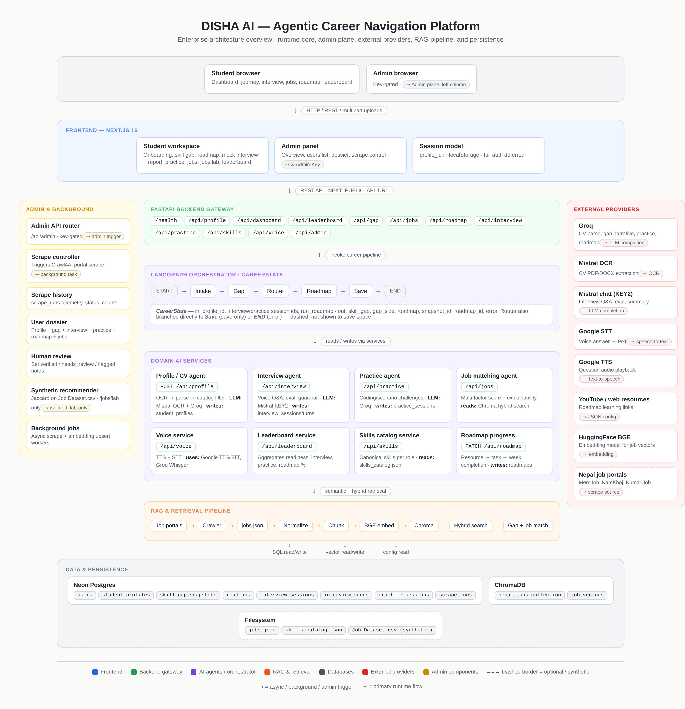

<p align="center">
  
</p>

# DISHA AI — Backend

Agentic career platform for Nepali students. See the [root README](../README.md) for the
product overview and [../frontend/README.md](../frontend/README.md) for the client side.

<p align="center">
  
</p>

```
app/
  main.py              # FastAPI — uv run uvicorn app.main:app --reload
  api/routes/          # health, profile, dashboard, leaderboard, gap, jobs, roadmap,
                       #   interview, practice, skills, voice, admin
  data/                # skills_catalog.json — canonical skills per role
  db/                  # Neon Postgres (profiles, sessions, snapshots, roadmaps, scrape_runs)
  rag/                 # jobs.json → Chroma ingest + search_jobs
  services/            # cv_parser, interview, practice, skill_gap, job_matching,
                       #   skill_overlap, skills_catalog, roadmap, synthetic_recommender, llm_utils
  orchestrator/        # LangGraph pipeline: intake -> gap -> route -> roadmap? -> save
    nodes/             # one file per graph node
    tools/             # LangChain @tool wrappers (search_jobs, profile, assessments)
    run.py             # standalone CLI: uv run python -m app.orchestrator.run
scraper/
  scraper.py           # ALL adapters + kamkhoj aggregator (see KAMKHOJ_PROBE.md)
  run.py               # CLI + execute_scrape_run (used by admin API too)
  logging_config.py    # console + data/logs/ file logging
scripts/refresh_jobs.sh
datasets/              # Job Datsset.csv — synthetic benchmark for /jobs/lab ONLY, not live jobs
data/                  # jobs.json, chroma/, logs/ (gitignored)
OPTIMIZATION_NOTES.md   # backend audit: bugs fixed, gaps closed, deliberate non-fixes
```

## Job sources

| Source | Strategy | Role |
|---|---|---|
| **kamkhoj** | SSR page 1 + Crawl4AI pagination + detail canonical URL | **PRIMARY aggregator** (~1,700 jobs) |
| merojob | public JSON API | hybrid enrichment (real skill tags) |
| kumarijob | Crawl4AI + SSR cards | hybrid enrichment |
| jobaxle | sitemap → JSON-LD | direct mode |
| jobsnepal | Laravel SSR | direct mode |
| jobejee | SSR + JSON-LD | direct mode |
| merorojgari | WordPress REST API | direct mode |

Probe write-up: [scraper/KAMKHOJ_PROBE.md](scraper/KAMKHOJ_PROBE.md). **Decision: hybrid-primary**
— default `--mode aggregator` uses KamKhoj only; `--mode hybrid` adds merojob + kumarijob for
skill enrichment (deduped by original URL, falling back to a per-source `id` dedup pass too).

No LinkedIn scraping (ToS).

## Setup (one-time)

```bash
cd backend
cp .env.example .env   # fill GROQ_API_KEY + DATABASE_URL at minimum
uv sync
uv run playwright install chromium
uv run alembic upgrade head
```

Required/optional keys — see [.env.example](.env.example) and the
[root README's environment table](../README.md#environment-variables).

## Daily workflow

**Terminal 1 — API:**
```bash
cd backend
uv run uvicorn app.main:app --reload --port 8000
# Docs: http://127.0.0.1:8000/docs
```

**Terminal 2 — scrape (aggregator default):**
```bash
cd backend
CRAWL4AI_BASE_DIRECTORY=./.crawl4ai uv run python -m scraper.run --mode aggregator --max-per-source 100 --log-db --log-file
```

**Terminal 3 — Chroma re-ingest after scrape:**
```bash
cd backend
uv run python -m app.rag.ingest --reset
```

**Or all-in-one:**
```bash
./scripts/refresh_jobs.sh 100
```

> The live API caches the embedding model + Chroma collection per process
> (`app.rag.retriever.warm_up()`, called from the FastAPI `lifespan`). Re-ingesting from a
> separate script process while the server is running leaves its cached handle stale —
> restart the API after a manual re-ingest to pick up the fresh index.

### Scrape modes

| Mode | Sources | When to use |
|---|---|---|
| `aggregator` (default) | kamkhoj only | Daily refresh — one site, ~1,700 jobs |
| `hybrid` | kamkhoj + merojob + kumarijob | Best skills coverage (deduped) |
| `direct` | 6 portal scrapers (no kamkhoj) | Fallback if KamKhoj breaks |

```bash
uv run python -m scraper.run --mode hybrid --max-per-source 50 --log-db
uv run python -m scraper.run --source kamkhoj --max-per-source 10   # single source
```

## Canonical skills catalog

`app/data/skills_catalog.json` is the single source of truth for "what skills exist" and
"what does this role need" — covers every role in `frontend/lib/careerRoles.js` (~40 roles,
300+ skills), each with a `category` and a skill list, plus a small `global_skills` list
(communication, teamwork, etc.) appended to every role.

`app/services/skills_catalog.py` exposes:

- `skills_for_role(target_role)` — catalog skills for a role, with a loose-match fallback
  (e.g. "Senior Backend Developer" still resolves to "Backend Developer"'s list)
- `normalize_skill(skill)` — resolves a free-text skill (alias or exact match) to its
  canonical display name, or `None` if unknown
- `filter_to_catalog(skills)` — keeps only catalog-recognized skills, normalized, deduped

Every place a skill is written or scored goes through this: onboarding's skill picker, CV
parsing (unknown skills are dropped with a warning listing what was left out, not silently
discarded), practice's skill suggestions, and skill-gap/job-matching's normalization —
`app/services/skill_gap.py`'s `normalize_skill_name()` prefers the catalog's canonical name
when a skill is known there, and falls back to its own free-text alias map otherwise, so
matching against the much broader vocabulary of real scraped job postings is unaffected.

| Endpoint | What it does |
|---|---|
| `GET /api/skills` | Full catalog: `{ version, roles, global_skills, all_skills, aliases }` |
| `GET /api/skills/by-role?role=...` | Skills for one role (loose-matched) |

## Admin API

Requires header `X-Admin-Key: <ADMIN_API_KEY>` on every route below (`require_admin`
dependency; 503 if `ADMIN_API_KEY` isn't set, 401 on a wrong/missing key).

**Scrape:**

| Endpoint | Description |
|---|---|
| `POST /api/admin/scrape` | Start background scrape (+ optional Chroma re-ingest) |
| `GET /api/admin/scrape/{id}` | Run status + per-source stats |
| `GET /api/admin/scrape/runs` | Recent runs |
| `GET /api/admin/scrape/sources/ranking` | Latest completeness ranking by source |

**Stats & human verification** (backs the `/admin` frontend panel — same DISHA visual
language as the student app, no login screen; the frontend attaches `X-Admin-Key` from
`NEXT_PUBLIC_ADMIN_API_KEY` automatically, see [../frontend/README.md](../frontend/README.md)):

| Endpoint | Description |
|---|---|
| `GET /api/admin/stats` | Platform counts: profiles, sessions today, gap runs, interviews/practice (total + completed), jobs indexed, latest scrape run |
| `GET /api/admin/users?limit=&q=` | Profile list with readiness + activity flags, searchable by name/email/role |
| `GET /api/admin/users/{profile_id}` | Full dossier — profile, latest gap snapshot, interview/practice history, roadmap + progress %, a live job-match preview, and category scores |
| `PATCH /api/admin/users/{profile_id}/verification` | `{status: verified\|needs_review\|flagged\|unreviewed, notes}` — stored in `profile.profile_meta.admin_verification`, no schema migration needed |
| `GET /api/admin/interviews?profile_id=&limit=` | All interview sessions across students (or one), summary fields |
| `GET /api/admin/interviews/{session_id}` | Full session + turns — the exact same shape the student's own report card renders, read-only |
| `GET /api/admin/practice?profile_id=&limit=` | All practice sessions across students |
| `GET /api/admin/gaps?profile_id=&limit=` | All skill-gap snapshots across students |
| `GET /api/admin/roadmaps?profile_id=&limit=` | All roadmaps across students, with `progress_pct` |
| `GET /api/admin/learning?profile_id=&limit=` | All generated learning curricula across students |

```bash
curl -X POST http://127.0.0.1:8000/api/admin/scrape \
  -H "X-Admin-Key: YOUR_KEY" \
  -H "Content-Type: application/json" \
  -d '{"mode":"aggregator","max_per_source":50,"reingest_chroma":true}'
```

## Learning curriculum agent

`app/services/learning_agent.py` (Mistral, `MISTRAL_API_KEY3` — falls back to
`MISTRAL_API_KEY2`'s quota if unset) generates a sectioned, module-based curriculum from the
student's skill gap — separate from the week-by-week roadmap. The LLM only ever writes a
module's title, description, and which single catalog skill it teaches; it never writes a URL.
Every module's `resources` are attached afterward from
`app.services.learning_resources.build_resources_for_skill()` (curated catalog + deterministic
search deep-links), and every module's skill is passed through
`skills_catalog.normalize_skill()` — a skill the catalog doesn't recognize is dropped rather
than kept as free text. Context (priority skills, the role's catalog skills, the existing
roadmap skeleton) is gathered via `app/orchestrator/tools/learning.py`'s `@tool`-decorated
functions before the single structured-output LLM call — the same "tools gather grounded
context, then one reliable structured call" shape as interview/practice/roadmap/gap narrative,
rather than a multi-turn tool-calling agent loop. Falls back to a deterministic one-module-
per-priority-skill curriculum if the LLM call fails.

| Endpoint | What it does |
|---|---|
| `POST /api/learning/generate` | `{profile_id, force?}` → generates (or returns the existing active one, unless `force`) |
| `GET /api/learning/{profile_id}` | latest active curriculum |
| `PATCH /api/learning/{profile_id}/progress` | `{section_id, module_id, completed, source: open\|manual\|scroll_prompt}` — also best-effort marks a matching roadmap node/task complete if the skill matches, so finishing a module advances both views |

## Profile / CV endpoints

| Endpoint | What it does |
|---|---|
| `GET /health`, `GET /health/db` | liveness + Postgres |
| `POST /api/profile` | save skills (catalog-filtered), target role, location |
| `GET /api/profile/{student_id}` | fetch profile |
| `POST /api/profile/upload-resume` | Mistral OCR 3 → Groq skills → `filter_to_catalog` (review before save) |
| `POST /api/interview/start` | create adaptive interview session from saved profile |
| `POST /api/interview/answer` | score one answer, detect off-topic/jailbreak attempts, generate the next question |
| `GET /api/interview/{student_id}/history` | fetch stored interview sessions + turns |
| `POST /api/voice/tts` | generate spoken audio from text using Google Cloud TTS |
| `POST /api/voice/stt` | transcribe uploaded audio using Google Cloud Speech-to-Text |

The interview's question generation, answer evaluation, and summary all run on
`ChatMistralAI` (`interview_mistral_model`, default `mistral-small-latest`) using
`MISTRAL_API_KEY2` — a separate key from OCR's `MISTRAL_API_KEY`, kept on its own quota. Every
LLM call across the app (interview, practice, skill gap) goes through
`app/services/llm_utils.py`'s `call_structured()`, which retries once before falling back to a
deterministic template — a single flaky response never surfaces as a 500 to the student.

**Off-topic / jailbreak guard** (`app/services/interview.py`): a deterministic regex catches
blatant prompt-injection attempts ("ignore previous instructions", "pretend you are...")
before the LLM ever sees them; subtler off-topic or gibberish answers are caught by the LLM's
own `off_topic` flag on its structured output. Either way, the refusal feedback text, a capped
score (≤3), and the next question are all **enforced server-side** rather than trusted to the
model's phrasing — DISHA always repeats the exact refusal line and re-asks the same question
rather than following whatever the student asked instead.

## Skill practice / game endpoints

Practice one skill at a time — separate from `/api/interview` (own tables). Student picks
1–3 catalog skills; each gets one challenge (coding for tech track, scenario for non-tech),
AI-scored 0–10 and passed at `practice_pass_threshold` (default 7.0). Challenges are generated
lazily (one Groq call per request) and difficulty adapts to the previous score. Groq only —
no code execution in this MVP (AI review of the submitted code/answer; API is shaped for a
sandboxed runner later).

| Endpoint | What it does |
|---|---|
| `POST /api/practice/skills/suggest` | `{profile_id}` → suggested skills (catalog-filtered claimed skills, falling back to the role's catalog list if none match) + track (tech/nontech) |
| `POST /api/practice/start` | `{profile_id, skills[1–3], difficulty: easy\|medium\|hard\|auto}` → session + first challenge |
| `POST /api/practice/{session_id}/submit` | coding: `{challenge_id, code, explanation?}`; scenario: `{challenge_id, answer}` → score, passed, next challenge or session summary |
| `GET /api/practice/{session_id}` | fetch a session with all challenges |
| `GET /api/practice/history/{profile_id}` | all practice sessions for a profile |

Session end returns a combined-gap-ready shape: `verified_strong_skills`,
`verified_weak_skills`, and `skill_scores` (`{skill: 0–10}`). `difficulty=auto` infers from
`years_of_experience`. Tech coding challenges also return `starter_code` + `expected_language`
(python/javascript/sql) for a Monaco editor.

Config (`app/config.py`): `practice_pass_threshold` (7.0),
`practice_max_skills_per_session` (3), `practice_groq_model`.

## Unified skill gap agent

The brain of Disha: merges **four signals** into one report and saves it as a
`skill_gap_snapshots` row (history kept — `GET` returns the latest by default).

1. **Claimed skills** — `student_profiles.skills` (catalog-normalized, what the student says they have)
2. **Market demand** — Chroma `search_jobs(target_role)` (what Nepal employers want)
3. **Interview proof** — latest *completed* interview: any `skill_tag` scored `<5` → weak, `>=7` → strong
4. **Practice proof** — latest *completed* practice session: its own `verified_strong_skills` / `verified_weak_skills`

Practice signal wins over interview signal for the same skill (it's a dedicated skill test); a
**weak** rating always overrides a **strong** one for the same skill regardless of source, so
one bad showing on a claimed skill still surfaces.

Every skill lands in one or more buckets: `matched` (claimed + market wants), `market_missing`
(market wants, not on CV), `verified_strong` / `verified_weak` (from interview/practice),
`overclaimed` (claimed but proved weak), or `claimed_unverified` (on CV, never tested).
`priority_learn` ranks the union of all skills by a documented 0–100 formula (see comments in
`app/services/skill_gap.py`). `readiness_score` (0–100) blends match ratio, verified-strong
ratio, interview score, and practice pass rate.

**Role & technical differentiation** (`role_fit` in the response): surfaces
`job_matching.py`'s role-conflict logic directly to the student — how many candidate postings
were considered vs. passed role-fit, and concrete examples of adjacent-but-different titles
that were excluded (e.g. why a "Sales Executive" posting didn't count as a match for a
"Backend Developer" target), so a low match score is explainable rather than a black box.

**Validation / evidence panel** (`evidence` in the response): an `accuracy_level`
(High/Medium/Low) computed from how many of the four signals are actually present, plus a
per-signal breakdown and a checklist of what to complete (interview, practice) to raise it —
so "trust me" is replaced with "here's exactly why this number is what it is."

The narrative (`generate_gap_narrative`, Groq) explains the computed `gap_data` in English +
one Nepali line — it is instructed to invent nothing, only cite numbers/skills/jobs already in
the payload; if Groq fails, a deterministic fallback narrative is built from the same data.

| Endpoint | What it does |
|---|---|
| `POST /api/gap` | `{profile_id, interview_session_id?, practice_session_id?, include_narrative?, run_roadmap?, n_jobs?}` → combined report, saved as a snapshot |
| `POST /api/gap/market` | `{profile_id}` or `{skills, target_role}` → market-only comparison (no interview/practice merge) |
| `GET /api/gap/{profile_id}` | latest snapshot |
| `GET /api/gap/{profile_id}/history?limit=10` | snapshot history |

Config (`app/config.py`): `gap_n_jobs` (20), `gap_include_narrative_default` (true).

## Multi-factor job matching

`app/services/job_matching.py` scores each Chroma candidate across skills, role similarity,
seniority, domain, education, location, and career-goal alignment — with explicit
`_ROLE_CONFLICT_RULES` (backend ≠ frontend, AI engineer ≠ instructor, product ≠ project
manager, etc.) and a generic-keyword suppression list so "AI", "Manager", "Developer" alone
never inflate a match. Display scores are compressed (`_calibrate_display_score`) so 100% is
rare. `app/services/skill_overlap.py` holds the shared Jaccard-overlap primitive also used by
the synthetic recommendation lab below, so both surfaces compute "matched vs. missing skills"
the same way.

| Endpoint | What it does |
|---|---|
| `POST /api/jobs/match` | `{profile_id, n?}` → ranked real Nepal jobs with full score breakdown (`match_score`, `factors`, `matched_skills`, `missing_skills`, `explanation`) |
| `GET /api/jobs/match/{profile_id}` | same, as a GET |
| `GET /api/jobs/status` | job corpus health: `jobs.json` count vs. Chroma count |

### Synthetic Recommendation Lab (not live jobs)

`backend/datasets/Job Datsset.csv` is a public 100k-row benchmark (500 unique generic jobs, a
fixed 10-skill vocabulary) used **only** by `/jobs/lab` on the frontend, to demo content-based
Jaccard scoring against a dataset with ground-truth labels — completely separate from the
Chroma-backed Nepal job corpus above. Its `Match_Score`/`Recommended` columns were measured to
have ~zero correlation with actual skill overlap (`app/services/synthetic_recommender.py`
documents this), so the lab's eval endpoint reports that mismatch honestly rather than
implying the real scorer should agree with it.

| Endpoint | What it does |
|---|---|
| `POST /api/jobs/synthetic-recommend` | `{skills, top_k}` → ranked synthetic jobs, scored by real Jaccard skill overlap |
| `POST /api/jobs/synthetic-eval` | `{sample_n}` → MAE + precision vs. the dataset's own labels, with the ground-truth caveat |

## Roadmap agent

Turns a snapshot's `gap_data` into either a full roadmap.sh-style skill path
(`path.phases[].nodes[]`, the current default) or a legacy week-by-week plan for older
roadmaps — both formats are supported by the same progress-tracking endpoints. Depth is
decided once by `classify_gap_size()` — `missing + weak >= 5` → **large** gap → deeper plan;
otherwise **small**. Nodes the student already demonstrably knows (claimed skills, matched
market skills, verified-strong results) are auto-checked at generation time with a "from your
profile" badge, so the path starts from where the student actually is.

| Endpoint | What it does |
|---|---|
| `POST /api/roadmap` | `{profile_id, snapshot_id?, force_replan?}` → generates + saves a roadmap |
| `GET /api/roadmap/{profile_id}` | latest roadmap (any status) |
| `PATCH /api/roadmap/{profile_id}/progress` | `{week, task_index, completed, resource_index?}` for the legacy week/task/resource format, **or** `{node_id, completed}` for the skill-path format — one endpoint, branches on which fields are present |

`compute_roadmap_progress_pct()` (`app/services/roadmap.py`) is the single implementation of
"% complete" shared by the leaderboard and admin dossier, mirroring the frontend's own
`lib/journeyState.js` logic so the number never disagrees between `/roadmap`, `/dashboard`,
`/leaderboard`, and `/admin`.

## Leaderboard

`app/api/routes/leaderboard.py` ranks all profiles by a blended composite score and returns a
**per-category breakdown** per entry — no synthetic/fake users, only real completed sessions:

```json
{
  "composite_score": 7.4,
  "category_scores": { "interview": 8.0, "practice": 7.2, "skill_gap": 65, "roadmap": 40 },
  "activities": ["Skill gap", "Roadmap", "2 interviews"]
}
```

| Endpoint | What it does |
|---|---|
| `GET /api/leaderboard?profile_id=&limit=` | Ranked entries + `your_rank` if `profile_id` given |

## LangGraph orchestrator

`app/orchestrator/graph.py` wires the whole pipeline as a real, runnable graph — not just a
skeleton:

```
START -> intake -> gap -> [route_after_gap] -> roadmap? -> save -> END
```

- **intake** (no LLM) — loads the profile, populates `student_skills`, `target_role`,
  `location`, `time_per_week`, `budget` into state.
- **gap** — `load_gap_context` + `compute_combined_skill_gap` (see above), optional Groq
  narrative, and `classify_gap_size` (the large/small threshold is computed exactly once here
  and read by both the router and the roadmap node).
- **route_after_gap** — `error` → END; `run_roadmap=False` → straight to **save** (snapshot
  only); otherwise → **roadmap**.
- **roadmap** — `app.services.roadmap.generate_roadmap`, sized by `gap_size`.
- **save** (no LLM) — persists `skill_gap_snapshots` (+ `roadmaps` if a plan was generated).

`POST /api/gap` and `POST /api/roadmap` call the same underlying service functions directly
rather than the compiled graph object, to avoid re-running work across two already-tested
endpoints — the graph itself is the reference pipeline, fully wired and independently
testable via its own CLI:

```bash
uv run python -m app.orchestrator.run --profile-id <uuid>
uv run python -m app.orchestrator.run --profile-id <uuid> --no-roadmap --no-narrative
```

### LangChain tools

`app/orchestrator/tools/` wraps the app's existing lookups as `@tool`-decorated functions —
one implementation each, reusable by any future agent: `search_jobs_tool` (wraps
`search_jobs()`, never duplicates retriever logic), `get_profile_tool`,
`get_latest_assessments_tool` (latest completed interview + practice summaries). Not yet wired
into a tool-calling agent loop — `roadmap_node` reads `sample_jobs` already present in
`gap_data` instead of re-querying, since the job list was already fetched computing the gap.

## Database connections

`app/db/session.py`'s async engine avoids `pool_pre_ping` (it costs a full extra round-trip to
Neon on every checkout over a long-haul connection) in favor of a background keep-alive task
(`app/main.py`'s lifespan, every 2 minutes) that keeps both the pool and Neon's compute warm —
so a reconnect cost lands on the background task, not a real request. `pool_size=10,
max_overflow=10` gives enough headroom for the dashboard's parallel fetch pattern without
falling back to disposable overflow connections.

## Tests

```bash
uv run pytest tests/ -v
```

Covers job matching (role-conflict penalties, seniority/experience fit, generic-keyword
suppression), the skills catalog (normalize/filter/role lookup), and the synthetic
recommender (Jaccard ordering, cold start). `pyproject.toml`'s `[tool.pytest.ini_options]`
sets `pythonpath = ["."]` so `app.*` imports resolve when running from `backend/`.

## Architecture notes

- **Chroma** = job market vectors only (`search_jobs` for skill gap + job matching)
- **Postgres** = student profiles + sessions + snapshots + roadmaps + `scrape_runs` telemetry
- **jobs.json** = human-readable scrape output; ingest into Chroma after each run
- **skills_catalog.json** = canonical skill list, versioned, not a database table
- Logs: `data/logs/scrape-{timestamp}.log` when using `--log-file`
